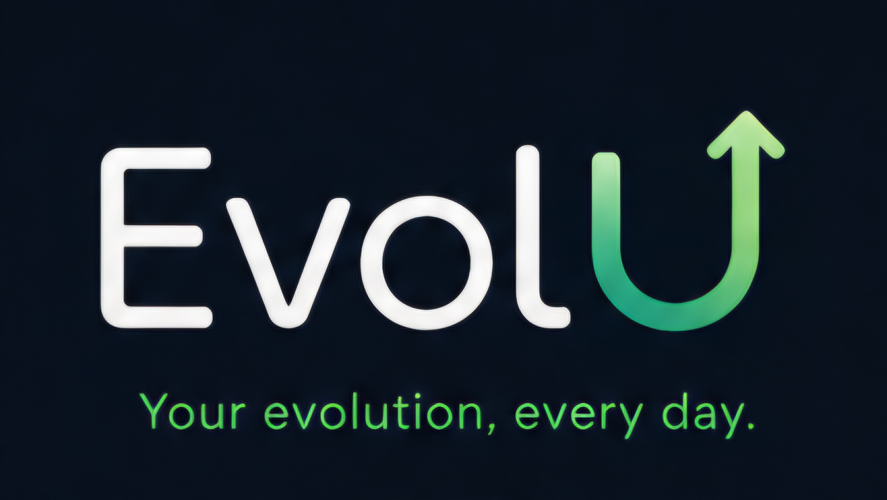

<p align="center">
  
</p>

<p align="center">
  A desktop to-do list and habit tracker with streaks, XP/levels, achievements, analytics, and focus sessions — built with Python and PySide6.
</p>

---

## Features

- **Unified dashboard** — today's tasks and habits in one view, with a personalized greeting and a circular daily-completion ring
- **Tasks** — priority levels, due dates/times, tags, notes, and a full "All Tasks" view grouped by day with a collapsible Completed section
- **Habits** — daily or specific-weekday recurrence, streak tracking, a GitHub-style completion heatmap per habit, and a week-view filter on the All Habits screen
- **Gamification** — XP and levels for completing tasks/habits, plus a set of unlockable achievements
- **Analytics** — habit completion rate, streak comparisons, and completed-tasks-by-tag, rendered with matplotlib
- **Daily/weekly review** — a glanceable summary of what got done and current streaks
- **Focus timer** — an open-ended focus session that runs in the background, plus a quick countdown timer with pause/resume
- **Notifications** — native OS notifications and an in-app notification log
- **Multiple profiles** — separate tasks, habits, and stats per profile, each with its own data
- **Export** — back up all data to JSON or CSV
- **Quick add** — dedicated keyboard shortcuts for every core action

## Tech stack

- **Language:** Python
- **GUI:** PySide6 (Qt for Python), styled with a custom QSS theme and Plus Jakarta Sans
- **Data:** SQLite via SQLAlchemy, stored in the OS-appropriate user data directory (`platformdirs`)
- **Charts:** matplotlib, embedded via `FigureCanvasQTAgg`
- **Notifications:** `plyer` for native OS toasts
- **Packaging:** PyInstaller (Windows `.exe`)

## Keyboard shortcuts

| Shortcut | Action |
|---|---|
| `Ctrl+T` | Add task |
| `Ctrl+H` | Add habit |
| `Ctrl+P` | New profile |
| `Ctrl+E` | Export data |
| `Ctrl+S` | Manage profile |

## Getting started

```bash
# Clone the repo
git clone https://github.com/Shyason/EvolU.git
cd EvolU

# Create and activate a virtual environment
python -m venv venv
.\venv\Scripts\Activate.ps1      # Windows PowerShell

# Install dependencies
pip install -r requirements.txt

# Run the app
python -m app.main
```

## Building a Windows executable

```bash
pip install pyinstaller
pyinstaller pyinstaller\windows.spec
```

The built app will be in `dist\EvolU.exe`.

## Project structure

```
app/
├── main.py                 # Entry point
├── data/                   # Data layer — SQLAlchemy models, repositories
├── business/                # Business logic — streaks, gamification, scheduling, analytics
└── ui/                      # PySide6 widgets, dialogs, and the QSS theme
```

## License

Fonts bundled in `app/ui/fonts/` are used under the SIL Open Font License 1.1.
